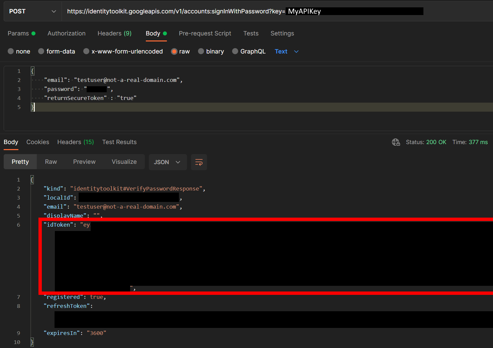
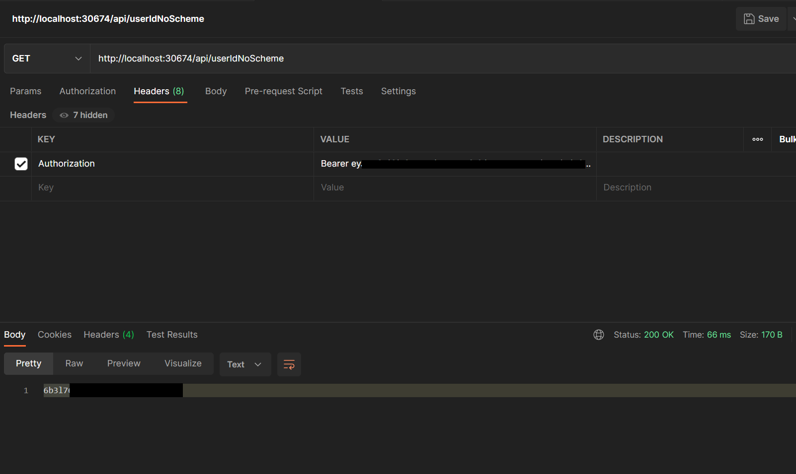
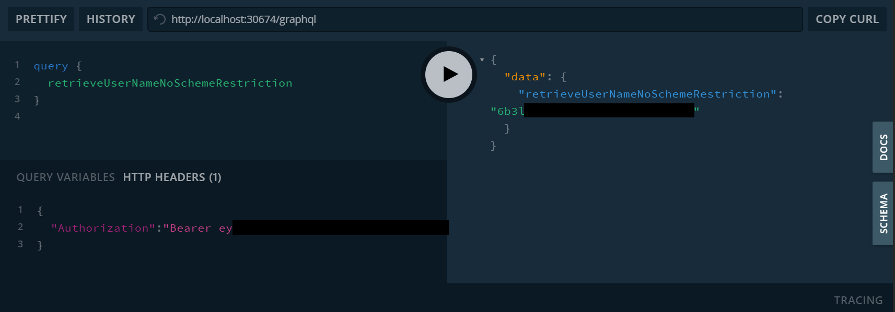
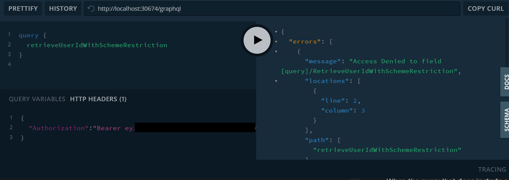

To Replicate [Issue 48](https://github.com/graphql-aspnet/graphql-aspnet/issues/48) follow these steps:

# Setup Firebase Authentication

### **1. Create a Firebase Project**
- Navigate to the [Firebase Console](https://console.firebase.google.com/) and create a new project.
### **2. Enable Authentication**

 - With your project active click on **Authentication** on the left hand side then click **Sign In Method**
 - Add the *Email/Password* native provider


### **3. Add a User Account**

 -  Click on the *Users* tab and add a new user. 
    - Note the User UID you'll need it to request a token
  


###  **4. Copy the Project Id and Web API Key**
- Click on **Project Overview** -> **Gear Icon** -> **Project Settings** and copy the Project ID and the Web API Key
  


### **5. Update Startup.cs with your project Id**
```csharp
public class Startup
{
    public const string FIREBASE_PROJECT_ID = "YOUR-PROJECT-ID";

    // Other code omitted
}
```
### **6. Obtain a JWT access_token for your user**
 - Issue a POST request to `https://identitytoolkit.googleapis.com/v1/accounts:signInWithPassword?key=[WEB-API-KEY] ` with the following body to obtain a JWT access token for your test user

```json
{
  "email": "testuser@not-a-real-domain.com",
  "password": "THE_USERS_PASSWORD",
  "returnSecureToken": "true"
}
```

- Copy the returned idToken
 


# Execute the Tests
### **1. Execute the Rest Controller Tests**
Execute a postman request against the REST end points, supplying the `idToken` obtained earlier as a bearer access_token and note that both end points return the User UID listed in the Firebase Console as expected. 

`GET: http://localhost:30764/api/userIdNoScheme`

`GET: http://localhost:30764/api/userIdWithScheme`




### **2. Execute the GraphQL Tests**
Using a GraphQL tool submit the identical graphql requests. Don't forget to include the authorization header with the expected bearer token.

#### When the query that **does not include** a specific scheme is executed the user id is returned as expected.



#### When the query that **does include** a specific scheme the request fails entirely.


